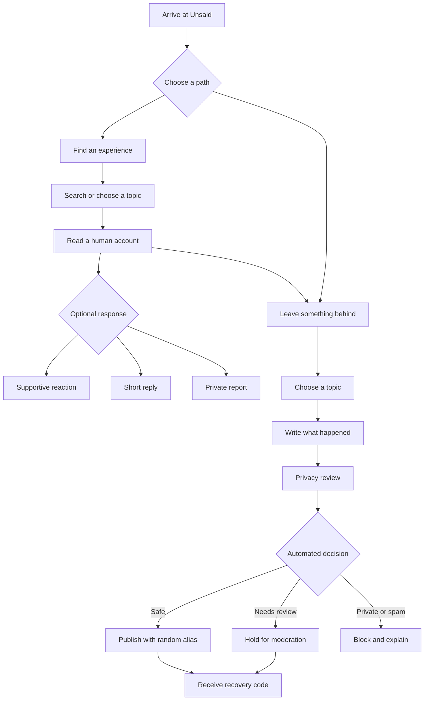
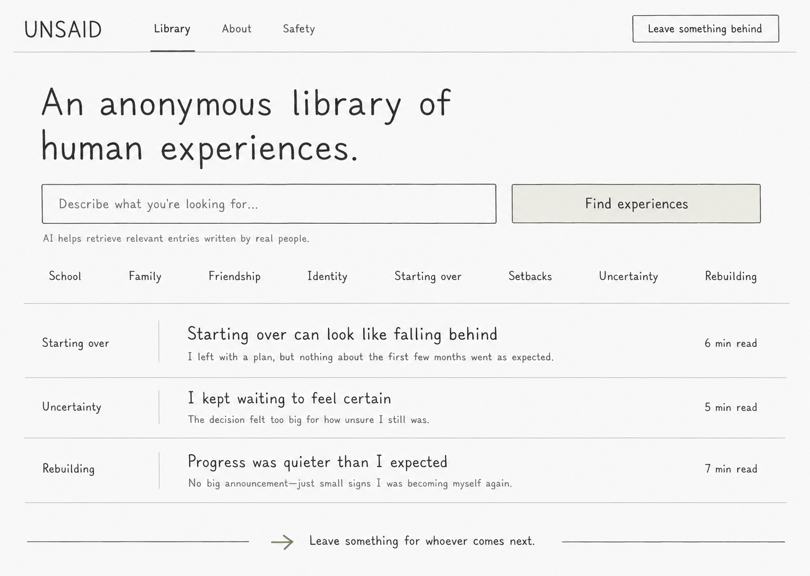
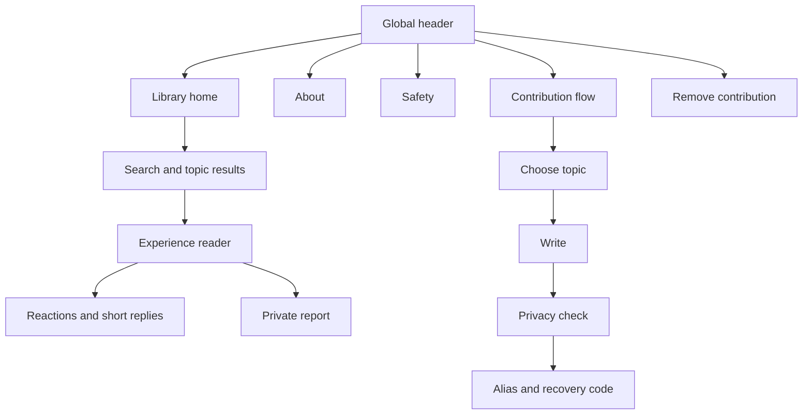
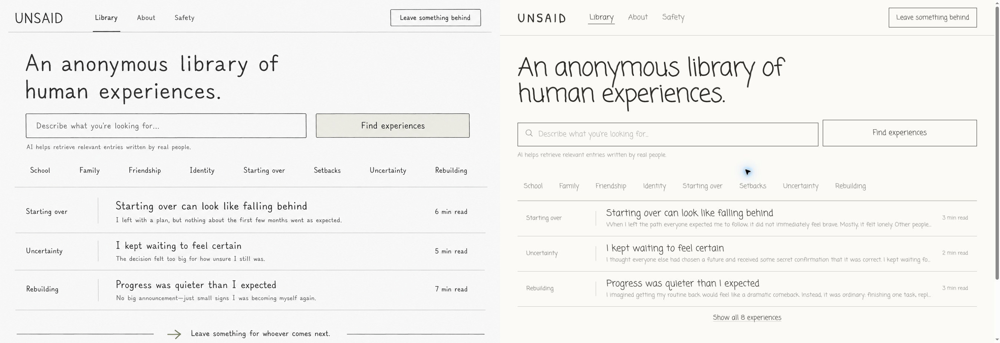
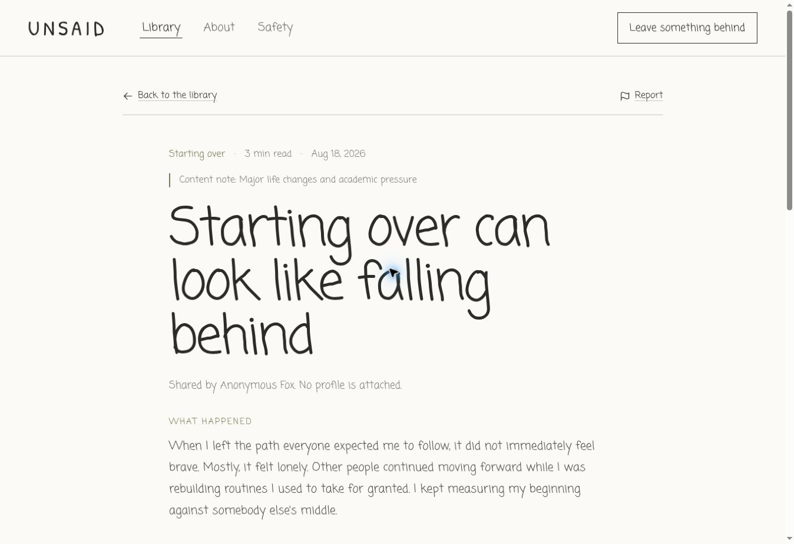
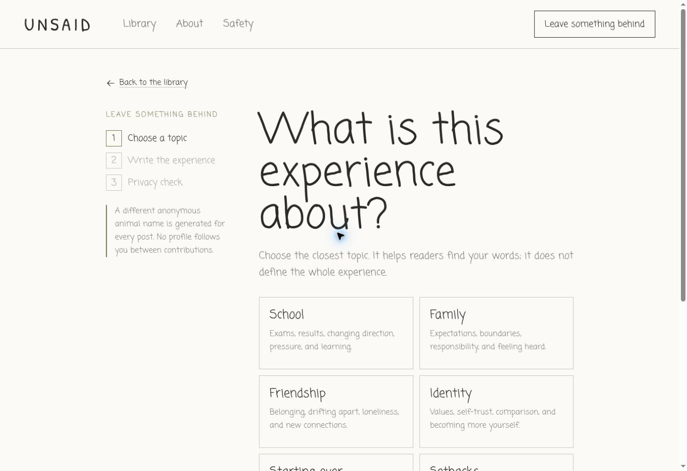

# Unsaid — Research, content, design, and first-testing plan

Last updated: 26 August 2026

This document gathers every research, content, feature, journey, guideline, and wireframe task developed for Unsaid. Sections are deliberately separate so user-testing feedback can be tied back to a specific assumption and used to plan future improvements.

## Contents

1. Project introduction
2. Related article or resource
3. Potential audience groups
4. Audience needs research
5. Content themes
6. Early sample entries
7. Essential features
8. Feature importance
9. User journey map
10. User-experience best practices
11. Submission-guideline research
12. Draft submission guidelines
13. Content categories
14. Revised sample content entries
15. Initial wireframes
16. Wireframe review and revisions
17. First user-testing experience
18. Technical architecture
19. Privacy, moderation, and abuse prevention
20. User-testing plan
21. Feedback questions
22. Measurement and future-improvement plan
23. Sources

---

## 1. Project introduction

### Introducing Unsaid

Unsaid is a place where people leave behind the things they wish someone had told them when they were going through something.

The idea came from something personal. I wanted a place like this to exist for my own experiences—somewhere I could talk without having to explain who I was, and find people who had been where I was before.

Unsaid is not a mental-health platform. It is an **experience-sharing community: an anonymous library of human experiences.**

A reminder that *someone has been here before, and you are not alone.*

There is AI here, but not to replace human connection. It does something much simpler:

**AI finds the humans. It does not replace them.**

It helps connect what someone is going through with real accounts left behind by people who experienced something similar.

No followers to gain. No likes to chase. No direct messages. No permanent profiles. No identity to maintain.

**Just you and your story.**

Come here when you need to find someone who has been there. When you are ready, leave something behind for whoever comes next.

Let’s go through things together instead of carrying them all alone.

Yours truly,  
**The Developer @ Unsaid**

### Product promise

Unsaid should help a visitor do one of two things without creating an account:

1. Find a genuine experience that feels relevant to what they are facing.
2. Leave a careful, anonymous account for the next person.

The first-testing build adds supportive reactions and short public replies as a hypothesis. These are not used for ranking, do not create profiles, and cannot become private conversations.

---

## 2. Related article or resource

The strongest research connection is the 2023 paper *Modeling Empathic Similarity in Personal Narratives*. The researchers examined whether a computer system could recognise when two personal accounts might emotionally resonate even when they use different words. Their method considered the event, emotional journey, and lesson within each narrative. In participant testing, empathic matching produced stronger connections than ordinary semantic retrieval.

This closely supports Unsaid’s central idea. A visitor describes what they are facing, and technology retrieves a human-written account based on more than shared keywords. The technology creates the route; the meaning still comes from another person.

For the first build, PostgreSQL full-text search is the practical starting point. Empathic or embedding-based retrieval should be introduced only after the team has enough consented, moderated content and a human-evaluated relevance benchmark.

Source: [Modeling Empathic Similarity in Personal Narratives — ACL Anthology](https://aclanthology.org/2023.emnlp-main.383/)

---

## 3. Potential audience groups

Potential audiences include:

- Teenagers and students dealing with exams, friendships, family expectations, changing schools, or uncertainty about the future.
- Young adults adjusting to university, employment, independence, and new responsibilities.
- People experiencing major life changes such as relocating, changing education or career direction, or rebuilding after a setback.
- People who feel isolated or misunderstood and want reassurance that someone else has faced something similar.
- People who find an experience difficult to discuss openly because of embarrassment, judgement, or cultural pressure.
- Quiet or introverted visitors who prefer reading personal accounts to joining live group conversations.
- People seeking an honest human perspective without the pressure of a public identity.
- People from communities in which personal difficulty is rarely discussed openly and anonymity makes sharing feel safer.
- Contributors who have moved beyond an experience and want their perspective to help someone else.
- Parents, teachers, mentors, and youth workers trying to understand experiences different from their own.
- Readers who want reflection and recognition rather than clinical advice or AI-generated reassurance.

### Initial audience focus

The strongest first audience is **teenagers and young adults navigating an experience they do not feel ready to discuss publicly**. The second is contributors who want something they learned to remain useful after the experience has passed.

### Recruitment groups for the first test

Recruit a small mix rather than only highly enthusiastic supporters:

- 3–4 people who expect to arrive mainly as readers.
- 3–4 people willing to try anonymous contribution.
- 2 people who are cautious about privacy or AI.
- 2 people who regularly use community or story platforms and can compare expectations.

No participant should be asked to disclose a genuinely sensitive experience during testing. Use the supplied neutral scenarios or fictionalised examples.

---

## 4. Audience needs research

Research suggests that Unsaid’s audience needs more than anonymity. It needs control, relevance, trust, emotional safety, and freedom from social pressure.

### Privacy and control

Users should be able to read and contribute without creating a profile. They need plain explanations of what is stored, how automation processes their writing, and how a contribution can be removed. Research on anonymous youth forums found that anonymity, searchability, and lasting access can help young people explore sensitive subjects through other people’s experiences. [Journal of Documentation study](https://www.emerald.com/jd/article/78/7/506/431939/Nameless-strangers-similar-others-the-affordances)

### Genuinely relevant accounts

Results should reflect the situation, emotion, and useful perspective within an entry instead of only matching exact words. Empathy-based retrieval research provides an important direction, but the first version should make its simpler keyword-based retrieval clear rather than implying capabilities it does not yet have.

### Freedom to remain a reader

Some visitors will not be ready to contribute. The complete value of Unsaid cannot depend on posting, reacting, or replying. Reading must remain a first-class ending.

### Validation without forced positivity

Participatory storytelling research suggests that viewing lived experiences can support connectedness, reassurance, and agency. Prompts should invite reflection without forcing every entry to become inspirational or neatly resolved. [Participatory storytelling study](https://pmc.ncbi.nlm.nih.gov/articles/PMC10067706/)

### Simple discovery

Visitors may not know how to describe what they need. Natural-language search, broad topics, visible examples, and a limited set of relevant results are more useful than an endless feed.

### Visible safety measures

An anonymous platform still needs clear rules, reporting, moderation, privacy warnings, and routes to suitable outside help when a situation falls beyond the product’s purpose. Research with younger users identifies privacy concerns, usability problems, and unsafe interactions as barriers to participation. [JMIR qualitative study](https://humanfactors.jmir.org/2025/1/e64097/)

### No popularity pressure

Followers, leaderboards, trending lists, public histories, and recommendation loops based on engagement would turn lived experience into performance. The first test includes supportive reaction counts, but entries are never ranked by them. Testing must determine whether even these counts feel helpful or competitive.

### Audience-need summary

The central need is **a private, low-pressure way to find an authentic human experience that feels relevant, without being judged, ranked, or answered by a chatbot.**

---

## 5. Content themes

The library should use broad human experiences instead of diagnoses or rigid labels.

### Core themes

- **Growing up** — independence, changing identity, feeling behind, and learning through mistakes.
- **School and academic pressure** — exams, disappointing results, burnout, changing educational paths, and comparison.
- **Family and expectations** — conflict, responsibility, strict households, feeling unheard, and pressure to meet expectations.
- **Friendship and belonging** — drifting apart, loneliness, exclusion, new friendships, and finding the right community.
- **Love and letting go** — rejection, changing relationships, trust, and accepting an ending without graphic or intimate detail.
- **Starting over** — moving, leaving school or work, rebuilding routines, and entering an unfamiliar environment.
- **Failure and rejection** — missed opportunities, unsuccessful applications, abandoned projects, and plans that did not work.
- **Dreams and uncertainty** — career choices, changing ambitions, fear of the wrong decision, and not having everything planned.
- **Identity and self-acceptance** — discovering values, feeling different, comparison, and learning self-trust.
- **Culture, faith, and community** — balancing personal choices with community expectations and belonging to more than one group.
- **Grief and endings** — processing loss and change without demanding a fixed timeline or a neat conclusion.
- **Responsibility and independence** — supporting family, becoming independent, caring for others, and feeling responsible too early.
- **Boundaries and difficult decisions** — saying no, walking away, protecting time, and making a careful choice.
- **Being misunderstood** — difficult-to-explain experiences, dismissed feelings, and words someone needed but did not receive.
- **Rebuilding** — regaining confidence, becoming consistent again, accepting slow progress, and noticing small improvements.

### Recurring story formats

- What I wish someone had told me
- What I believed then versus what I know now
- What helped—and what did not
- If you are in the middle of this
- The part nobody warned me about
- A mistake I learned from
- Something I am still figuring out
- What happened after I thought the plan was over
- A reminder for whoever comes next

### First-version scope

The first build uses eight topics: **School, Family, Friendship, Identity, Starting over, Setbacks, Uncertainty, and Rebuilding.** These are broad enough to begin testing without producing an overwhelming taxonomy.

---

## 6. Early sample entries

These entries deliberately vary in voice and structure so the library does not feel like a collection of identical motivational posts.

### You are not your worst result

**Theme: Academic pressure**

I thought one disappointing result had exposed something about me—that perhaps I had been pretending to be capable all along.

What I wish someone had told me is that a result can be accurate about one performance without being accurate about your whole future. I still had to accept what went wrong and change how I prepared. I did not have to turn one result into an identity.

You are allowed to be disappointed without deciding that you are a disappointment.

### Starting over can look like falling behind

**Theme: Change and new beginnings**

When I left the path everyone expected me to follow, it did not immediately feel brave. Mostly, it felt lonely. Other people continued moving while I was rebuilding routines I used to take for granted.

I wish someone had told me that starting again rarely looks impressive from the inside. It looks like confusion, small decisions, and days when you wonder whether leaving was a mistake.

My new path eventually began to feel like my own—not because every doubt disappeared, but because I stopped using someone else’s timeline to measure it.

### Some friendships end without a villain

**Theme: Friendship and belonging**

Nothing terrible happened between us. There was no final argument and nobody to blame. We simply stopped knowing how to reach each other.

For a long time, I searched for the moment I could have prevented it. I wish I had known that not every friendship survives every version of you. Something can have been real and important even if it does not last forever.

I still miss who we were. I no longer treat missing it as proof that I should return to it.

### You can love your family and still need room

**Theme: Family and expectations**

I used to believe that being grateful meant agreeing with every decision made for me. Whenever I wanted something different, guilt arrived before I could explain myself.

What I needed to hear was that love and disagreement can exist together. Wanting space does not automatically mean rejecting the people who raised you. Choosing another direction does not erase everything they have done for you.

I am still learning to speak honestly without becoming cruel or disappearing into silence. I have not solved it completely, but I understand that my voice is not an act of betrayal.

### I kept waiting to feel certain

**Theme: Dreams and uncertainty**

I thought everyone else had chosen a future and received a secret confirmation that it was correct. I kept waiting for that certainty before beginning anything.

It never came.

What changed was realising that a decision did not need to answer the rest of my life. Sometimes it only needs to answer what I want to explore next. Changing direction after learning something does not make the earlier choice meaningless.

Clarity sometimes arrives after movement, not before it.

### Progress was quieter than I expected

**Theme: Rebuilding**

I imagined getting my routine back would feel like a dramatic comeback. Instead, it was ordinary: finishing one task, replying to something I had avoided, and trying again after an unproductive day.

Because the changes were small, I kept thinking they did not count. Looking back, those were the changes that rebuilt everything.

Progress does not always announce itself. Keep the small evidence.

---

## 7. Essential features

Unsaid’s features support two journeys: finding someone who has been there and leaving something for the next person.

### Core user features

- Account-free reading and submission.
- A different generated identity for each post, such as **Anonymous Fox**.
- Natural-language search over human-written experiences.
- Topic browsing and filters.
- Focused story reader with topic and optional content note.
- Submission prompts for topic, what happened, what helped, and what the contributor wishes they had known.
- Optional “what helped” and “what I wish I had known” fields.
- Supportive reactions that do not affect ranking.
- Short public replies with a strict character limit.
- Private reporting.
- A recovery code for removing a post without an account.
- Clear About, Safety, and Submission Guidelines pages.

### Privacy and safety

- No public profiles, followers, direct messages, or contributor histories.
- HTTP-only anonymous session cookie; only one-way session hashes reach storage.
- Direct identifying information blocked before publication.
- Ambiguous location, institution, or safety wording held for review.
- Automated spam and repetition checks.
- Separate feature-level rate limits for posts, replies, reactions, reports, and recovery attempts.
- Repeated reports temporarily hide content for moderation.
- Server-side length, topic, and workflow validation.
- High-privacy defaults and data minimisation.

### Operations

- Moderation status on every post and reply.
- Database indexes for status, topic, full-text search, and reporting.
- Privacy-respecting analytics plan based on task completion rather than personal profiling.
- Accessible, responsive layout with keyboard focus, real labels, readable contrast, and clear form errors.
- Supabase migration and seed data.
- Vercel-ready Next.js project.

---

## 8. Feature importance

| Feature | Importance | Reason |
|---|---:|---|
| Anonymous reading and submission | Critical | Requiring an identity or account would stop many intended users before value is reached. |
| Human-written library | Critical | Authentic experiences are the product’s foundation; matching has no value without them. |
| Privacy detection and clear warnings | Critical | “Anonymous” is misleading if an entry accidentally reveals a person. |
| Moderation, filtering, and reporting | Critical | Anonymous contribution without visible safety creates predictable abuse and trust problems. |
| Topic browsing and search | Critical | Users need a useful route even when they cannot describe their situation precisely. |
| No profiles, followers, rankings, or DMs | Critical | These constraints protect the library from becoming an identity or popularity system. |
| Mobile-friendly reading | High | Visitors may arrive in an emotional or time-limited moment and need low-friction reading. |
| Guided contribution prompts | High | Prompts improve clarity without demanding strong writing skill. |
| Recovery-code removal | High | Contributors need lasting control despite the absence of accounts. |
| Transparent match explanations | High, later | Useful when embeddings are introduced; not necessary for simple full-text search. |
| Supportive reactions | Test hypothesis | May offer recognition, but visible counts could recreate popularity pressure. |
| Short replies | Test hypothesis | May add human connection, but increase moderation work and social pressure. |
| Related experiences | Medium | Helpful after the reader works, but not more important than discovery quality. |
| Embedding-based retrieval | Later | Requires a strong corpus, consent, evaluation data, and monitoring for poor matches. |
| Multilingual support | Later | Valuable for inclusion, but the initial taxonomy and moderation should first be tested in one language. |

### Priority order

1. Create trust: privacy, anonymity, moderation, reporting, and boundaries.
2. Provide genuine value: a strong library, categories, and clear search.
3. Test human connection: supportive reactions and brief replies without profiles.
4. Give contributors control: clear prompts and a private removal method.
5. Improve retrieval: measure full-text search before adding embeddings.

---

## 9. User journey map

### Journey 1: Find an experience

| Stage | User action | User need | Platform response |
|---|---|---|---|
| Arrival | Opens the library | Understand the purpose quickly | Explains the anonymous human library and offers search plus topics. |
| Expression | Describes a situation | Use natural language without publishing it | Searches across safe, published entries. |
| Results | Reviews a small set | Relevant material without overload | Displays human-written matches in thin, scannable rows. |
| Reading | Opens an entry | Recognition, perspective, and calm | Uses a focused reader without feed distractions. |
| Response | Reacts, replies, or reports | A low-pressure way to respond | Stores a supportive reaction, accepts a brief moderated reply, or sends a private report. |
| Completion | Leaves or contributes | Control over the ending | No forced sign-up, follow, or engagement loop. |

### Journey 2: Leave something behind

| Stage | User action | User need | Platform response |
|---|---|---|---|
| Topic | Chooses a broad subject | Organise without being boxed in | Offers eight human-experience categories with descriptions. |
| Writing | Adds title and what happened | Express the experience clearly | Shows plain prompts, character limits, and optional reflection fields. |
| Review | Reads the preview | Confidence and privacy | Highlights identifying details to remove and explains moderation. |
| Submission | Confirms and submits | Understand what happens next | Runs server-side validation, privacy, spam, safety, and rate-limit checks. |
| Identity | Receives a generated alias | Remain anonymous without feeling machine-labelled | Creates a fresh animal alias only for that contribution. |
| Control | Saves recovery code | Remove a contribution later | Stores only a one-way hash and provides a removal page. |

---

## 10. User-experience best practices

### Clarity and control

Nielsen Norman Group’s usability principles emphasise visible system status, familiar language, consistency, error prevention, and user freedom. Applied to Unsaid, every search, submission, moderation outcome, reply, reaction, report, and removal action needs immediate status. Users can go back, edit, cancel, or leave without punishment. [Nielsen Norman Group usability heuristics](https://www.nngroup.com/articles/ten-usability-heuristics/)

### Accessibility from the first build

WCAG 2.2 guidance supports interfaces that are perceivable, operable, understandable, and compatible with assistive technology. Unsaid uses readable contrast, real labels, visible focus, practical touch targets, semantic headings, reduced-motion support, and textual errors. [W3C WCAG overview](https://www.w3.org/WAI/standards-guidelines/wcag/)

W3C also recommends splitting long forms into logical stages, announcing progress, listing errors clearly, and explaining how to correct them. This directly informed the three-step contribution flow. [W3C forms tutorial](https://www.w3.org/WAI/tutorials/forms/) and [W3C user notifications](https://www.w3.org/WAI/tutorials/forms/notifications/)

### Privacy and younger users

The ICO Children’s Code recommends high-privacy defaults, best-interest design, and collecting only what is necessary. Unsaid therefore avoids account data, blocks identifying details, stores anonymous identifiers as hashes, and separates optional participation from core reading. [ICO Children’s Code](https://ico.org.uk/for-organisations/uk-gdpr-guidance-and-resources/childrens-information/childrens-code-guidance-and-resources/age-appropriate-design-a-code-of-practice-for-online-services/) and [ICO data minimisation](https://ico.org.uk/for-organisations/uk-gdpr-guidance-and-resources/childrens-information/childrens-code-guidance-and-resources/age-appropriate-design-a-code-of-practice-for-online-services/8-data-minimisation/)

### Transparent automation

NIST identifies accountability, transparency, privacy, reliability, security, and fairness as characteristics of trustworthy AI. Unsaid should state whether a result comes from keyword search or later embedding retrieval, explain what automated checks do, and keep human moderation in the loop. [NIST AI Risk Management Framework](https://www.nist.gov/itl/ai-risk-management-framework)

### Test task success, not time spent

Early tests should ask whether people understand the product, find a relevant entry, recognise the privacy boundaries, submit safely, and remove a post. Longer sessions, more reactions, or higher reply counts are not automatically better outcomes.

---

## 11. Submission-guideline research

Effective submission guidance should work before, during, and after writing.

### Make rules specific enough to act on

“Be respectful” is difficult to apply by itself. Rules should identify the intended behaviour: write from personal experience, remove identifying information, do not demand private contact, and avoid presenting one experience as a universal solution.

### Put guidance beside the action

A policy page alone is not enough. The contribution form repeats the most important rule—remove identifying details—before the preview and consent step.

### Validate in the browser and on the server

OWASP recommends syntactic and semantic validation and stopping unsuitable input as early as possible. The browser provides quick feedback, but the server repeats every important check because client state cannot be trusted. [OWASP Input Validation Cheat Sheet](https://cheatsheetseries.owasp.org/cheatsheets/Input_Validation_Cheat_Sheet.html)

### Rate-limit each abuse-prone feature

OWASP recommends feature-level rate limiting rather than treating authentication as the only control. This matters especially for an account-free product. Posts, replies, reactions, reports, and recovery attempts therefore have separate limits. [OWASP Business Logic Security](https://cheatsheetseries.owasp.org/cheatsheets/Business_Logic_Security_Cheat_Sheet.html)

### Explain errors in text and show the correction

W3C guidance says a rejected form should identify what is wrong rather than simply returning the user to the same screen. Unsaid returns plain issues such as “Remove an email address before submitting,” keeps the draft intact, and lets the writer edit it. [WCAG error identification](https://www.w3.org/WAI/WCAG22/Understanding/error-identification.html)

### Use graduated moderation outcomes

Not every uncertain entry should be silently deleted. The system uses three outcomes:

- **Allow:** content passes checks and publishes in the test build.
- **Review:** content may reveal a place or institution, or needs closer safety assessment.
- **Block:** direct private information, links, spam, or repeated promotional content is returned to the writer for correction.

### Keep automation humble

Automated detection can miss context and produce false positives. The interface tells users what was detected, the Safety page explains limitations, and reporting remains available after publication.

---

## 12. Draft submission guidelines

### Write for the person who comes next

1. **Share your own experience.** Write from your point of view. Do not expose, accuse, or identify another person.
2. **Protect private details.** Remove names, contact details, usernames, links, exact locations, schools, workplaces, and anything that could reveal an identity.
3. **Leave perspective, not instructions.** Describe what happened and what helped you. Do not present your experience as a guaranteed solution or professional advice.
4. **Keep it relevant.** Choose the closest topic and include only the context a reader needs.
5. **Make replies kind and brief.** Acknowledge the experience or add a careful perspective. Do not demand answers, judge the writer, or ask for private contact.
6. **Do not promote or flood.** Spam, advertising, repeated text, copied submissions, and attempts to manipulate reactions are removed.
7. **Accept moderation.** Automated checks may block private details or hold an entry for review. Reader reports can temporarily hide content while it is checked.

### Pre-submission reminder

Read the entry once as if it belonged to someone else. Remove details that could reveal a person, check that the title matches the experience, and decide whether you are comfortable with supportive reactions and short replies.

---

## 13. Content categories

The first taxonomy is deliberately small.

| Category | Includes | Avoids |
|---|---|---|
| School | Exams, results, courses, changing direction, pressure, learning | Naming a school, teacher, or classmate |
| Family | Expectations, disagreement, responsibility, boundaries, feeling heard | Identifying relatives or making public accusations |
| Friendship | Belonging, loneliness, drifting apart, new friendships | Naming or exposing another person |
| Identity | Values, self-trust, comparison, changing goals | Profiles, labels forced by the platform, appearance ranking |
| Starting over | Moving, new routines, transitions, unfamiliar environments | Exact locations or workplaces |
| Setbacks | Rejection, mistakes, missed opportunities, changed plans | Blaming or targeting a named person or organisation |
| Uncertainty | Decisions, the future, unclear next steps, doubt | Pretending certainty or professional authority |
| Rebuilding | Quiet progress, confidence, consistency, beginning again | Guaranteed outcomes or forced positivity |

### Later category candidates

Only add these when real submissions show repeated demand: culture and community, faith, responsibility, boundaries, grief and endings, creativity, work, relocation, and caring for others. New categories should reduce discovery confusion rather than simply increase the menu.

---

## 14. Revised sample content entries

These entries are seeded in the first-testing build.

| Topic | Title | What helped | What the writer wishes they had known |
|---|---|---|---|
| Starting over | Starting over can look like falling behind | Choosing one ordinary next step and avoiding timeline comparison | Slow progress does not automatically mean the choice was wrong. |
| Uncertainty | I kept waiting to feel certain | Treating the next choice as an experiment | Clarity can arrive after movement. |
| Rebuilding | Progress was quieter than I expected | Keeping small evidence of change | Progress does not always announce itself. |
| School | The result arrived before I was ready | Reviewing what worked and changing one part of preparation | One result does not describe a whole future. |
| Family | I did not need the perfect explanation | Writing down the one point that needed communicating | Respect and disagreement can exist together. |
| Friendship | Being included was not the same as belonging | Creating enough distance to notice mutual friendships | A friendship need not be terrible before it can feel wrong. |
| Identity | Changing my mind did not make me fake | Naming the new information that changed the decision | An earlier choice can be sincere without staying permanent. |
| Setbacks | The rejection did not give me directions | Separating the lost opportunity from remaining options | A closed path is not the final description of what is possible. |

### Sample short replies

- “I needed the reminder that a restart has its own timeline. Thank you for leaving this here.”
- “Calling the next choice an experiment makes it feel possible rather than permanent.”
- “A result as information instead of identity is a much kinder and more useful way to see it.”

Short replies model recognition and perspective. They do not ask for personal information, invite private contact, or instruct the contributor.

---

## 15. Initial wireframes

### Selected direction: Human Archive

The selected option uses the library—not brand explanation—as the first screen. Its visual language is warm off-white, hand-drawn typography, fine rules, restrained olive accents, and almost no card decoration.

### Screen structure

### Low-fidelity layout map

| Screen | Main regions | Primary action | Secondary action |
|---|---|---|---|
| Library | Header, purpose line, search, topic strip, story rows, contribution prompt | Find experiences | Choose topic or open entry |
| Experience | Back/report toolbar, story, optional reflection blocks, reactions, replies | Read the experience | React, reply, report, or contribute |
| Contribution 1 | Progress, topic cards | Choose topic | Return to library |
| Contribution 2 | Title, happened, optional helped, optional wish-known | Continue to privacy | Go back |
| Contribution 3 | Preview, safety explanation, confirmations | Submit anonymously | Edit draft |
| Confirmation | Generated alias, publication status, recovery code | Save code | Read entry or return |
| Safety | Plain-language protections and automation limits | Read guidelines | Contribute |
| Manage | Recovery-code field and confirmation | Remove contribution | Leave without action |

### Responsive intent

- Desktop preserves the wide editorial rows from the selected wireframe.
- Tablet keeps search and topics prominent while allowing story metadata to wrap.
- Mobile turns the header into a menu, keeps controls at least 44 pixels tall, stacks story metadata, and preserves the same calm reading order.

---

## 16. Wireframe review and revisions

### What worked in the initial sketch

- The purpose was understandable before scrolling.
- Search and topic browsing supported both confident and uncertain visitors.
- Thin rows made the library feel archival rather than social.
- The contribution prompt completed the “receive, then leave” loop.
- A restrained monochrome design made personal writing the focus.

### Problems discovered during reflection

1. **The original concept had no place for the newly requested reactions and replies.** Adding them directly to list rows would make the home page feel like a feed.
2. **Anonymous contribution needed clearer system feedback.** A single form could not adequately explain identity generation, privacy detection, moderation, and recovery.
3. **“AI helps” would overstate the first implementation.** PostgreSQL full-text search is not empathic matching.
4. **Reports needed a private, specific flow.** A single report button with no reason would produce weak moderation data.
5. **No-account control needed an actual removal experience.** A recovery code without a destination is incomplete.
6. **Visible reaction counts risked reproducing popularity pressure.** They needed to remain out of ranking and be tested as a separate hypothesis.

### Revisions made

- Reactions and short replies appear only in the focused reader, not as a feed under every library item.
- Submission became a three-stage flow: topic, writing, privacy review.
- Safe entries publish under a new generated alias; uncertain entries wait for review; private information and spam return a correction.
- Search language now truthfully describes retrieval rather than claiming current AI matching.
- The report interaction asks for a reason and optional detail, remains private, and can hide heavily reported content.
- A recovery-code removal page gives contributors control without accounts.
- Supportive reactions are limited to three contextual responses and never affect discovery order.
- About, Safety, Guidelines, empty, error, success, blocked, review, and not-found states were added.

### Visual revision notes

The implementation retains the selected header, thin lines, off-white paper background, irregular handwritten typography, wide search row, horizontal categories, story list, and closing contribution message. Additional flows use the same square controls, low decoration, line-based sections, and olive state color instead of introducing generic rounded cards or gradients.

In the comparison above, the selected wireframe is on the left and the implemented homepage is on the right. The final visual review found no release-blocking layout or accessibility problems. The implementation deliberately adds a “Show all” control, footer navigation, clearer search disclosure, and realistic story text because the testing build must support a complete journey rather than remain a static sketch. Mobile stacking is implemented with responsive breakpoints, but it should still be observed on participants’ real devices during testing.

The final production-preview check also confirmed that library expansion, natural-language search, topic filtering, story navigation, and all three contribution steps respond correctly. A safe sample draft reached the enabled final-submit state; the test stopped before publication so no artificial contribution was added to the library.

---

## 17. First user-testing experience

### What is included

- Complete responsive library home.
- Eight seeded experiences across all launch topics.
- Full-text-style demo search and topic filtering.
- Experience reader with optional content note.
- Three supportive reaction types.
- Short replies capped at 280 characters.
- Private reporting with five reasons.
- Three-step anonymous contribution.
- Random alias per post or reply.
- Privacy, spam, repetition, and safety checks.
- Feature-level rate limits.
- Recovery-code removal.
- About, Safety, and Guidelines content.
- In-memory demo mode for immediate testing.
- Supabase/PostgreSQL mode when environment values and migration are supplied.

### Implemented screen samples

### Deliberate exclusions

- No accounts or login.
- No profiles or contributor history.
- No followers or direct messages.
- No trending page, endless feed, or engagement ranking.
- No AI-generated advice or story content.
- No embedding retrieval until evaluation criteria exist.
- No file or image uploads in the first test.
- No notifications, because they would encourage return pressure and require more identity state.

### Main hypotheses

1. Visitors understand that Unsaid contains human-written experiences, not chatbot responses.
2. Search and eight topics are enough to find an entry without an endless feed.
3. A generated animal alias feels private without feeling cold or dehumanising.
4. Optional “what helped” and “what I wish I had known” prompts improve usefulness without forcing a lesson.
5. Supportive reactions add recognition without creating competition.
6. Short replies add connection without turning the product into a discussion network.
7. The privacy step helps writers remove identifying details without making contribution feel frightening.
8. A recovery code is understandable enough to provide control without an account.

---

## 18. Technical architecture

### Implemented stack

| Layer | Choice | Purpose |
|---|---|---|
| Frontend and server | Next.js 16 App Router | Server-rendered pages, route handlers, metadata, and Vercel compatibility. |
| UI | React 19 | Interactive search, contribution, reaction, reply, report, and removal flows. |
| Styling | Tailwind CSS 4 plus shared design tokens | Responsive layout while preserving the selected handmade visual direction. |
| Database | Supabase PostgreSQL | Posts, replies, reactions, reports, rate-limit events, moderation status, and full-text search. |
| Anonymous sessions | HTTP-only random ID cookie | Abuse control and reaction toggling without accounts; only a keyed hash is stored. |
| Search now | PostgreSQL full-text search | Low-cost, explainable first retrieval system. |
| Search later | Embeddings with human evaluation | Meaning-based retrieval after enough moderated content and relevance labels exist. |
| Hosting | Vercel Hobby | Natural Next.js deployment path for a small personal testing project. |

Next.js documents the App Router as its current route system for layouts, server and client components, and route handlers. [Next.js App Router documentation](https://nextjs.org/docs/app)

Tailwind’s current Next.js guide uses its PostCSS plugin and a CSS import. [Tailwind CSS with Next.js](https://tailwindcss.com/docs/guides/nextjs)

Supabase recommends enabling Row Level Security on exposed tables. This project additionally routes all writes through server handlers and removes direct anonymous table privileges. [Supabase RLS documentation](https://supabase.com/docs/guides/database/postgres/row-level-security)

PostgreSQL full-text search is available directly through Supabase and provides a practical first search layer. [Supabase full-text search](https://supabase.com/docs/guides/database/full-text-search)

### Runtime modes

**Demo mode:** Used automatically when Supabase environment values are missing. Seed data and mutations live in server memory. This is suitable for the cloud preview and short moderated tests, but resets when the server restarts and should not be treated as production persistence.

**Supabase mode:** Activated when `NEXT_PUBLIC_SUPABASE_URL` and `SUPABASE_SERVICE_ROLE_KEY` are set. Run the supplied migration and seed file first. All mutations remain server-only.

### Free hosting and domain option

Vercel’s Hobby plan is free for personal projects and small-scale applications. Every deployment automatically receives a generated URL ending in `.vercel.app`, which is the recommended free first-test address. A separate custom domain is optional and normally requires owning that domain. [Vercel Hobby plan](https://vercel.com/docs/plans/hobby) and [Vercel generated domains](https://vercel.com/docs/domains/working-with-domains)

Supabase currently offers a $0 Free plan for small projects, including a PostgreSQL database. Current limits can change; as of this document, the official page lists a 500 MB database and notes that free projects may pause after inactivity. [Supabase pricing](https://supabase.com/pricing)

### Environment configuration

- `NEXT_PUBLIC_SUPABASE_URL`: project URL; safe for the client by itself, although this app uses it on the server.
- `SUPABASE_SERVICE_ROLE_KEY`: server only; never expose with a `NEXT_PUBLIC_` prefix.
- `UNSAID_SERVER_SECRET`: long random server secret used when hashing session and recovery values.
- `NEXT_PUBLIC_SITE_URL`: deployed site origin for metadata and future absolute links.

---

## 19. Privacy, moderation, and abuse prevention

### Anonymous identity model

- A random UUID is stored in an HTTP-only, SameSite cookie.
- The raw value is never written to PostgreSQL.
- A keyed SHA-256 hash connects rate limits and a visitor’s one reaction per post.
- Every new post and reply receives a random alias such as Anonymous Fox or Anonymous Wren.
- Aliases do not lead to a profile and are not guaranteed to remain consistent across submissions.

### Private-information handling

The current deterministic filter blocks:

- Email addresses
- Phone-number-like sequences
- Social usernames
- Web links
- Exact-looking street addresses

It flags for review:

- Wording that may reveal a school or workplace
- Wording that may reveal an exact meeting or home location
- Content requiring a closer safety decision

The UI also asks the contributor to perform a manual privacy check because pattern matching cannot understand every context.

### Spam and flood controls

- 3 posts per 15 minutes per anonymous session
- 8 replies per 10 minutes
- 24 reaction changes per minute
- 6 reports per 30 minutes
- 8 recovery attempts per 15 minutes
- Text repetition, excessive repeated characters, links, and common promotion patterns are rejected

In demo mode, limits are held in memory. In Supabase mode, a security-definer database function records and checks feature-level events, which is more appropriate for Vercel’s serverless environment.

### Moderation states

- `published`: publicly retrievable.
- `review`: invisible to public queries until a moderator decision.
- `deleted`: removed through the recovery flow.

Three reports from separate anonymous-session hashes temporarily move an entry to `review`. This threshold is a test default, not a final policy; it must be monitored for coordinated misuse.

### Important limitations before public launch

- Deterministic filters will miss some private details and wrongly flag some safe text.
- Anonymous cookies can be cleared; rate limits should also use privacy-preserving network-level controls at scale.
- A real moderator dashboard, audit trail, appeal workflow, and response target are still required.
- Recovery codes cannot currently edit an entry, only remove it.
- A legal/privacy review is required before collecting real submissions, particularly if the service is likely to be used by children.
- Safety and support links must be localised by deployment region and maintained by a responsible adult or organisation.

---

## 20. User-testing plan

### Test objective

Determine whether people understand Unsaid, can find a relevant human experience, trust the anonymous contribution model, and complete the key flows without assistance.

### Session format

- 30–40 minutes per participant.
- One facilitator and, if available, one note-taker.
- Ask the participant to think aloud without defending the design.
- Use neutral scenarios rather than asking for personal disclosures.
- Do not collect names in product feedback unless separately necessary and consented.

### Suggested tasks

1. **First impression:** Look at the home page for 10 seconds, then explain what the site is and what you can do there.
2. **Search:** Imagine you received a disappointing result and feel behind. Find an experience that could be relevant.
3. **Browse:** Find an entry about starting over without using search.
4. **Read:** Open an entry and explain what is human-written, what is automated, and what the platform does not promise.
5. **React:** Leave the reaction that best represents how the entry affected you. Explain whether the number beside it feels supportive or competitive.
6. **Reply:** Leave a short response using supplied neutral text. Explain what kinds of replies you expect to be allowed.
7. **Report:** Report the test entry as containing private information. Explain what you expect to happen next.
8. **Contribute:** Use a fictional scenario to create a post, include only “what happened,” check privacy, and submit it.
9. **Privacy block:** Add the supplied fictional email `sample@example.test` and observe whether the product stops the submission and explains the fix.
10. **Control:** Use the recovery code to explain how you would remove a contribution. If time permits, complete the removal.

### Observation sheet

For each task record:

- Completed without help / completed with help / not completed
- Time to first useful action
- Misunderstood label or control
- Privacy or safety confusion
- Trust comment
- Emotional-pressure comment
- Unexpected behaviour
- Participant quote, paraphrased if it contains personal information
- Severity: blocks use / causes hesitation / minor preference

### Facilitator rules

- Do not explain the interface until the participant has tried.
- Do not ask the participant to share a real private experience.
- Stop or change the scenario if the participant appears uncomfortable.
- Separate opinions from observed task difficulty.
- At the end, explain that demo data may reset and that this is not yet a public support service.

---

## 21. Feedback questions

### Comprehension

1. In your own words, what is Unsaid?
2. Who wrote the experiences you saw?
3. What role do you think automation or AI plays here?
4. What would you expect to happen after submitting an entry?

### Discovery

5. Was search or topic browsing the more natural starting point?
6. Did the suggested entries feel relevant to the test scenario?
7. Were any topics unclear, missing, or too broad?
8. Did the amount of content feel calm, empty, or overwhelming?

### Trust and privacy

9. What information do you think Unsaid stores about you?
10. Did a random name such as Anonymous Fox feel private, playful, distracting, or childish?
11. Did the privacy check make you feel safer or more nervous about submitting?
12. Would you understand why an entry was blocked or held for review?
13. Would you trust a recovery code as your only removal method?

### Reactions and replies

14. Did supportive reactions feel meaningfully different from likes?
15. Did the counts make the entry feel validated or ranked?
16. Did short replies add useful human connection?
17. Would you prefer replies to be hidden, delayed for moderation, or removed entirely?
18. Did you expect to receive notifications or private messages after replying?

### Overall experience

19. What felt most valuable?
20. What felt least trustworthy?
21. At what point would you leave the site?
22. What would need to change before you would contribute a real experience?

### Closing scale questions

Use a 1–5 scale and always ask “Why?” afterward:

- I understood what Unsaid is.
- I could find a relevant experience.
- The site felt calm and low-pressure.
- I understood how my privacy was protected.
- I trusted the generated anonymous identity.
- Reactions felt supportive rather than competitive.
- Replies improved the experience.
- I felt in control of a contribution after submitting it.

---

## 22. Measurement and future-improvement plan

### First-test success indicators

- At least 8 of 10 participants correctly describe Unsaid as a human-written experience library rather than an AI advice product.
- At least 8 of 10 find a relevant entry without facilitator help.
- At least 7 of 10 complete the contribution flow using a fictional scenario.
- Every participant can identify at least two details that should be removed for privacy.
- At least 8 of 10 understand that a random alias does not create a profile.
- At least 7 of 10 can explain how to remove a post.
- No participant expects a reaction or reply to start a private conversation.

These thresholds are learning targets, not claims of statistical significance.

### Key product metrics after a limited beta

Collect only aggregate, privacy-respecting events:

- Search submitted
- Search produced at least one result
- Result opened
- Topic selected
- Contribution started
- Privacy step reached
- Submission allowed, reviewed, or blocked
- Block corrected successfully
- Reaction selected or removed
- Reply submitted, published, or reviewed
- Report submitted
- Recovery removal completed

Do not create cross-session behavioural profiles. Use short retention and document every event’s purpose.

### Decision rules

| Evidence | Likely decision |
|---|---|
| Users call reactions “likes” or compare counts | Hide counts, make reactions private, or remove them. |
| Replies create fear of judgement or moderation burden | Delay all replies for review, restrict to preset responses, or remove replies. |
| Generated animal names feel childish | Test neutral word pairs or numbered aliases while keeping per-post identity. |
| Search often returns zero or irrelevant results | Improve text ranking, synonyms, and content tags before adding embeddings. |
| Users misunderstand automation as advice | Strengthen copy and match explanations; never imply machine empathy. |
| Privacy blocks are frequent but correct | Move detection earlier and highlight exact fields before review. |
| Privacy blocks are frequently wrong | Narrow patterns, add user appeal, and measure false positives. |
| Recovery codes are lost or confusing | Test an optional device-held recovery token without collecting an account identity. |
| Topic selection causes hesitation | Allow “Not sure” and infer a review-only topic suggestion. |
| Contributors skip optional reflection fields | Keep them optional; study whether readers still find those entries useful. |

### Search roadmap

1. Measure PostgreSQL search success and zero-result queries.
2. Add curated synonyms and topic tags.
3. Build a consented evaluation set of query–entry relevance judgements.
4. Prototype embeddings offline and compare with full-text search.
5. Review privacy, bias, and false-match risks.
6. If embeddings materially improve relevance, introduce them with plain match explanations and a manual browsing alternative.

### Moderation roadmap

1. Add a moderator dashboard and decision audit trail.
2. Define response targets and escalation ownership.
3. Measure block precision, review volume, report agreement, and coordinated-report abuse.
4. Add contributor appeal or correction for false positives.
5. Localise safety language, privacy notices, and outside-support routes for the actual launch region.

### Accessibility roadmap

1. Keyboard-only test of every task.
2. Screen-reader test of navigation, errors, progress, reactions, replies, and report dialog.
3. 200% text zoom and narrow-width check.
4. Test with longer translated labels before adding multilingual content.
5. Verify contrast and focus in browser high-contrast modes.

---

## 23. Sources

### Human stories and audience needs

- [Modeling Empathic Similarity in Personal Narratives — ACL Anthology](https://aclanthology.org/2023.emnlp-main.383/)
- [Nameless strangers, similar others — Journal of Documentation](https://www.emerald.com/jd/article/78/7/506/431939/Nameless-strangers-similar-others-the-affordances)
- [Participatory storytelling study — PMC](https://pmc.ncbi.nlm.nih.gov/articles/PMC10067706/)
- [Qualitative study of younger users and digital participation — JMIR](https://humanfactors.jmir.org/2025/1/e64097/)

### UX, accessibility, privacy, and safety

- [Nielsen Norman Group usability heuristics](https://www.nngroup.com/articles/ten-usability-heuristics/)
- [Nielsen Norman Group usability introduction](https://www.nngroup.com/articles/usability-101-introduction-to-usability/)
- [W3C WCAG](https://www.w3.org/WAI/standards-guidelines/wcag/)
- [W3C forms tutorial](https://www.w3.org/WAI/tutorials/forms/)
- [W3C user notifications](https://www.w3.org/WAI/tutorials/forms/notifications/)
- [ICO Children’s Code](https://ico.org.uk/for-organisations/uk-gdpr-guidance-and-resources/childrens-information/childrens-code-guidance-and-resources/age-appropriate-design-a-code-of-practice-for-online-services/)
- [ICO data minimisation](https://ico.org.uk/for-organisations/uk-gdpr-guidance-and-resources/childrens-information/childrens-code-guidance-and-resources/age-appropriate-design-a-code-of-practice-for-online-services/8-data-minimisation/)
- [NIST AI Risk Management Framework](https://www.nist.gov/itl/ai-risk-management-framework)
- [OWASP Input Validation Cheat Sheet](https://cheatsheetseries.owasp.org/cheatsheets/Input_Validation_Cheat_Sheet.html)
- [OWASP Business Logic Security Cheat Sheet](https://cheatsheetseries.owasp.org/cheatsheets/Business_Logic_Security_Cheat_Sheet.html)

### Technology and hosting

- [Next.js App Router](https://nextjs.org/docs/app)
- [Tailwind CSS with Next.js](https://tailwindcss.com/docs/guides/nextjs)
- [Supabase Row Level Security](https://supabase.com/docs/guides/database/postgres/row-level-security)
- [Supabase full-text search](https://supabase.com/docs/guides/database/full-text-search)
- [Supabase pricing](https://supabase.com/pricing)
- [Vercel Hobby plan](https://vercel.com/docs/plans/hobby)
- [Vercel generated deployment domains](https://vercel.com/docs/domains/working-with-domains)
